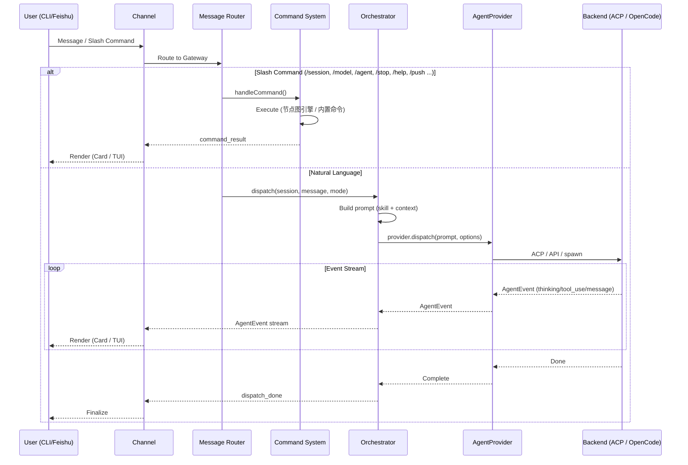

# OpenCrossAgent

Cross-agent orchestration gateway with multi-channel support (CLI + Feishu).

## 架构图

### 总览 (ASCII Art)

```
┌─────────────────────────────────────────────────────────────────────────┐
│                         Channel Layer                                   │
│                                                                         │
│  对接前端：接收用户消息 + 回传 agent 执行过程中的事件给前端渲染            │
│                                                                         │
│  ┌─────────────────────────┐    ┌─────────────────────────┐             │
│  │   CLI Channel           │    │   Feishu Channel        │             │
│  │                         │    │                         │             │
│  │  WebSocket (localhost)  │    │  Feishu WebSocket       │             │
│  │  接收: user_input /     │    │  接收: 飞书消息 / @bot   │             │
│  │        slash_command    │    │  回传: 卡片流式更新      │             │
│  │  回传: agent_event 流   │    │                         │             │
│  │        (TUI 渲染)       │    │                         │             │
│  └───────────┬─────────────┘    └───────────┬─────────────┘             │
│              │                               │                           │
└──────────────┼───────────────────────────────┼───────────────────────────┘
               │                               │
               └───────────────┬───────────────┘
                               │
                               ▼
┌─────────────────────────────────────────────────────────────────────────┐
│                        Gateway Core                                     │
│                                                                         │
│  ┌──────────────────────────────────────────────────────────────────┐   │
│  │  Message Router                                                   │   │
│  │  ├ /command ? ──► Command System                                  │   │
│  │  └ 自然语言   ──► Orchestrator                                    │   │
│  └──────────────────────────────────────────────────────────────────┘   │
│                                                                         │
│  ┌──────────────────────┐  ┌────────────────────────────────────────┐   │
│  │  Command System      │  │  Orchestrator                           │   │
│  │                      │  │                                        │   │
│  │  CommandScanner      │  │  AgentOrchestrator                     │   │
│  │  (4级目录扫描)        │  │  ├ direct mode  (直接执行)              │   │
│  │                      │  │  ├ plan mode    (只读分析规划)           │   │
│  │  CommandExecutor      │  │  └ enhance mode (技能增强提示词)        │   │
│  │  (节点图引擎)         │  │                                        │   │
│  │                      │  │  UnifiedDispatchPipeline                │   │
│  │  内置命令:            │  │  ├ prompt building (budget-aware)      │   │
│  │  /session list        │  │  ├ skill injection                     │   │
│  │  /session new        │  │  └ AgentEvent stream production        │   │
│  │  /session switch      │  │                                        │   │
│  │  /session delete      │  │  SessionStore (基础设施)                │   │
│  │  /model               │  │  ├ session 持久化 (~/.opencross/)       │   │
│  │  /agent               │  │  ├ providerSessionId 映射              │   │
│  │  /stop                │  │  └ resume-session 续接                 │   │
│  │  /help                │  │                                        │   │
│  │                      │  │  SessionQueue                           │   │
│  │  自定义命令:           │  │  (串行 dispatch, max 10 排队)           │   │
│  │  JSON-defined         │  │                                        │   │
│  │  /push /bump /merge   │  │                                        │   │
│  └──────────────────────┘  └──────────────────┬─────────────────────┘   │
│                                               │                         │
└───────────────────────────────────────────────┼─────────────────────────┘
                                                │
                                                ▼
┌─────────────────────────────────────────────────────────────────────────┐
│                    Agent Provider Layer                                  │
│                                                                         │
│  IAgentProvider                                                         │
│  ├ dispatch(prompt, options): AsyncGenerator<AgentEvent>                │
│  ├ listModels(): Promise<ModelInfo[]>                                    │
│  ├ createSession(): Promise<SessionRef>                                │
│  ├ resumeSession(ref): Promise<void>                                   │
│  └ stopSession(id): Promise<void>                                      │
│                                                                         │
│  ProviderRegistry                                                       │
│  ├ register(name, provider)                                             │
│  ├ get(name): IAgentProvider                                           │
│  └ resolve(name?): IAgentProvider                                       │
└───────────────────────────────┬─────────────────────────────────────────┘
                                │
                                ▼
┌─────────────────────────────────────────────────────────────────────────┐
│                    Agent Backend Layer                                   │
│                                                                         │
│  ┌──────────────────────┐  ┌──────────────────────┐                      │
│  │ CodelyCli Provider   │  │ OpenCode Provider    │                      │
│  │                      │  │                      │                      │
│  │ ACP 协议 (JSON-RPC)  │  │ OpenCode Protocol    │                      │
│  │ 长驻进程              │  │ (Effect.js 服务)      │                      │
│  │                      │  │                      │                      │
│  │ --resume-session     │  │ SessionV2 API        │                      │
│  │ --output-format      │  │ 事件流               │                      │
│  │   stream-json        │  │   (SessionRunner)     │                      │
│  │                      │  │                      │                      │
│  │ MCP 工具支持          │  │ Tool schema 系统     │                      │
│  │ Extension 生态        │  │ Plugin 生态           │                      │
│  └──────────────────────┘  └──────────────────────┘                      │
└─────────────────────────────────────────────────────────────────────────┘
         │                        │
         └───────────┬────────────┘
                    │
                    ▼
┌─────────────────────────────────────────────────────────────────────────┐
│                      MCP Tool Server                                     │
│  current_context / list_sessions / list_providers / send_image           │
└─────────────────────────────────────────────────────────────────────────┘
```

### 架构图 (Mermaid)

```mermaid
graph TB
    subgraph "Users"
        U1[CLI User]
        U2[Feishu User]
    end

    subgraph "Channel Layer"
        CLI[CLI Channel<br/>WebSocket + TUI<br/>接收消息 + 回传 agent_event 流]
        FS[Feishu Channel<br/>Feishu WebSocket + Cards<br/>接收消息 + 流式卡片更新]
    end

    subgraph "Gateway Core"
        ROUTER[Message Router<br/>路由: /command 或 自然语言]
        CS[Command System<br/>Scanner + Executor<br/>含 /session /model /agent 等命令]
        ORC[Orchestrator<br/>direct / plan / enhance]
        SS[SessionStore + SessionQueue<br/>基础设施: 持久化 + 串行 dispatch]
    end

    subgraph "Agent Provider Layer"
        REG[ProviderRegistry]
        IAP[IAgentProvider Interface]
    end

    subgraph "Agent Backend Layer"
        CLP[CodelyCli Provider<br/>ACP Protocol<br/>长驻进程 + MCP + Extension]
        OCP[OpenCode Provider<br/>OpenCode Protocol<br/>SessionV2 + Tool schema + Plugin]
    end

    subgraph "MCP"
        MCP[Tool Server<br/>context / sessions / providers]
    end

    U1 -->|WebSocket| CLI
    U2 -->|Feishu WS| FS

    CLI --> ROUTER
    FS --> ROUTER

    ROUTER -->|/command| CS
    ROUTER -->|自然语言| ORC

    CS --> SS
    ORC --> SS
    ORC --> REG

    REG --> IAP

    IAP --> CLP
    IAP --> OCP

    CLP -.->|MCP stdio| MCP
    MCP -.->|HTTP REST| ROUTER
```

### 消息流程图



## License

MIT
