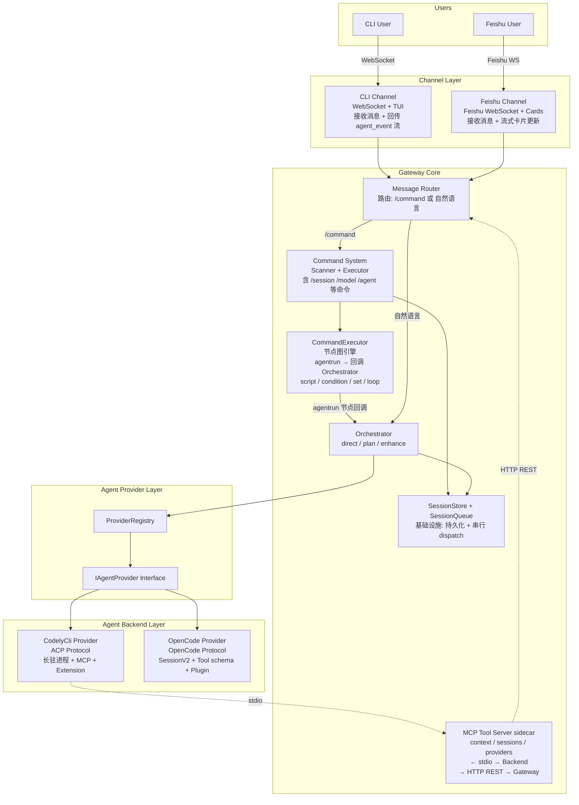
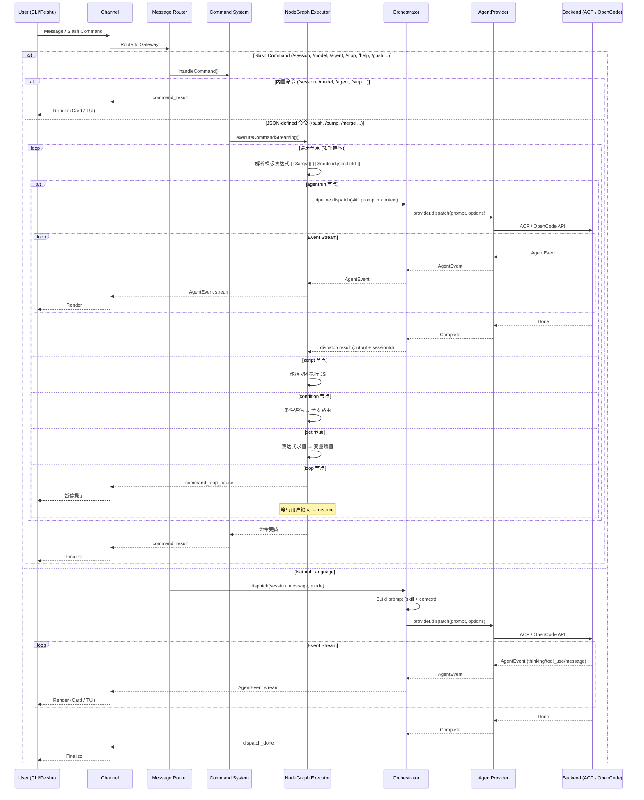

# OpenCrossAgent

Cross-agent orchestration gateway with multi-channel support (CLI + Feishu).

## 架构图

### 总览 (ASCII Art)

```
┌─────────────────────────────────────────────────────────────────────────┐
│                         Channel Layer                                   │
│                                                                         │
│  对接前端：接收用户消息 + 回传 agent 执行过程中的事件给前端渲染            │
│                                                                         │
│  ┌─────────────────────────┐    ┌─────────────────────────┐             │
│  │   CLI Channel           │    │   Feishu Channel        │             │
│  │                         │    │                         │             │
│  │  WebSocket (localhost)  │    │  Feishu WebSocket       │             │
│  │  接收: user_input /     │    │  接收: 飞书消息 / @bot   │             │
│  │        slash_command    │    │  回传: 卡片流式更新      │             │
│  │  回传: agent_event 流   │    │                         │             │
│  │        (TUI 渲染)       │    │                         │             │
│  └───────────┬─────────────┘    └───────────┬─────────────┘             │
│              │                               │                           │
└──────────────┼───────────────────────────────┼───────────────────────────┘
               │                               │
               └───────────────┬───────────────┘
                               │
                               ▼
┌─────────────────────────────────────────────────────────────────────────┐
│                        Gateway Core                                     │
│                                                                         │
│  ┌──────────────────────────────────────────────────────────────────┐   │
│  │  Message Router                                                   │   │
│  │  ├ /command ? ──► Command System                                  │   │
│  │  └ 自然语言   ──► Orchestrator                                    │   │
│  └──────────────────────────────────────────────────────────────────┘   │
│                                                                         │
│  ┌──────────────────────────────────────────────────────────────────┐   │
│  │  Command System                                                   │   │
│  │                                                                  │   │
│  │  CommandScanner (4级目录扫描: workspace > user > builtin)         │   │
│  │  ├ 内置命令: /session /model /agent /stop /help                   │   │
│  │  └ JSON-defined 命令: /push /bump /merge ...                      │   │
│  │                                                                  │   │
│  │  CommandExecutor (节点图引擎)                                      │   │
│  │  ├ 拓扑排序 → 顺序执行 → 节点间数据传递                             │   │
│  │  ├ 模板表达式: {{ $args }} {{ $node.id.json.field }}              │   │
│  │  │                                                                │   │
│  │  │  节点类型:                                                     │   │
│  │  │  ┌────────────┐  ┌──────────┐  ┌───────────┐                  │   │
│  │  │  │ agentrun   │  │ script   │  │ condition │                  │   │
│  │  │  │ 调用编排器  │  │ 沙箱 JS  │  │ 条件分支   │                  │   │
│  │  │  │ + skill 注入│  │          │  │ (true/false)│                 │   │
│  │  │  └─────┬──────┘  └──────────┘  └───────────┘                  │   │
│  │  │        │                     ┌───────────┐  ┌───────────┐     │   │
│  │  │        │                     │ set       │  │ loop       │     │   │
│  │  │        │                     │ 变量赋值   │  │ 多轮交互   │     │   │
│  │  │        │                     └───────────┘  │ pause/resume│    │   │
│  │  │        │                                    └───────────┘     │   │
│  │  │        └──────────────────────────────────────────────────────┘   │
│  │  │                         │                                         │
│  │  │     agentrun 节点回调    │                                         │
│  │  │     ┌──────────────────┐│                                         │
│  │  │     │ UnifiedDispatch  ││                                         │
│  │  │     │ Pipeline         │├──────────► (见 Orchestrator)            │   │
│  │  │     │ .dispatch()     ││                                         │   │
│  │  │     └──────────────────┘│                                         │   │
│  │  │                         │                                         │   │
│  │  └──────────────────────────┼─────────────────────────────────────────┘   │
│  │                             │                                         │
│  │  ┌──────────────────────────▼───────────────────────────────────────┐   │
│  │  │  Orchestrator                                                     │   │
│  │  │                                                                  │   │
│  │  │  AgentOrchestrator                                               │   │
│  │  │  ├ direct mode  (直接执行)                                        │   │
│  │  │  ├ plan mode    (只读分析规划)                                     │   │
│  │  │  └ enhance mode (技能增强提示词)                                    │   │
│  │  │                                                                  │   │
│  │  │  UnifiedDispatchPipeline                                          │   │
│  │  │  ├ prompt building (budget-aware)                                │   │
│  │  │  ├ skill injection                                               │   │
│  │  │  └ AgentEvent stream production                                  │   │
│  │  │                                                                  │   │
│  │  │  SessionStore + SessionQueue (基础设施)                            │   │
│  │  │  ├ session 持久化 (~/.opencross/)                                 │   │
│  │  │  ├ providerSessionId 映射                                        │   │
│  │  │  └ resume-session 续接                                           │   │
│  │  └──────────────────────────────┬───────────────────────────────────┘   │
│  │                                 │                                     │
│  │  ┌──────────────────────────────▼──────────────────────────────────┐│
│  │  │  MCP Tool Server (Gateway sidecar)                               ││
│  │  │  ├ current_context  (session/workspace/provider 状态)             ││
│  │  │  ├ list_sessions    (会话列表)                                    ││
│  │  │  ├ list_providers   (可用 agent provider)                        ││
│  │  │  ├ send_image       (图片发送到 channel)                         ││
│  │  │  └ break_command_loop (中断循环)                                  ││
│  │  │                                                                 ││
│  │  │  ← stdio →  Agent Backend (provider 注入给子进程)                ││
│  │  │  → HTTP REST → Gateway Core (查询 session/provider 状态)        ││
│  │  └─────────────────────────────────────────────────────────────────┘│
│  │                                                                       │
│  └─────────────────────────────────────────────────────────────────────┘
│                                    │                                     │
└────────────────────────────────────┼─────────────────────────────────────┘
                                     │
                                     ▼
┌─────────────────────────────────────────────────────────────────────────┐
│                    Agent Provider Layer                                  │
│                                                                         │
│  IAgentProvider                                                         │
│  ├ dispatch(prompt, options): AsyncGenerator<AgentEvent>                │
│  ├ listModels(): Promise<ModelInfo[]>                                    │
│  ├ createSession(): Promise<SessionRef>                                │
│  ├ resumeSession(ref): Promise<void>                                   │
│  └ stopSession(id): Promise<void>                                      │
│                                                                         │
│  ProviderRegistry                                                       │
│  ├ register(name, provider)                                             │
│  ├ get(name): IAgentProvider                                           │
│  └ resolve(name?): IAgentProvider                                       │
└───────────────────────────────┬─────────────────────────────────────────┘
                                │
                                ▼
┌─────────────────────────────────────────────────────────────────────────┐
│                    Agent Backend Layer                                   │
│                                                                         │
│  ┌──────────────────────┐  ┌──────────────────────┐                      │
│  │ CodelyCli Provider   │  │ OpenCode Provider    │                      │
│  │                      │  │                      │                      │
│  │ ACP 协议 (JSON-RPC)  │  │ OpenCode Protocol    │                      │
│  │ 长驻进程              │  │ (Effect.js 服务)      │                      │
│  │                      │  │                      │                      │
│  │ --resume-session     │  │ SessionV2 API        │                      │
│  │ --output-format      │  │ 事件流               │                      │
│  │   stream-json        │  │   (SessionRunner)     │                      │
│  │                      │  │                      │                      │
│  │ MCP 工具支持          │  │ Tool schema 系统     │                      │
│  │ Extension 生态        │  │ Plugin 生态           │                      │
│  └──────────────────────┘  └──────────────────────┘                      │
└─────────────────────────────────────────────────────────────────────────┘
```

### 架构图 (Mermaid)



### 消息流程图



### Command 节点图示例

```
/push 命令 — 4 节点线性工作流:

  review_code          review_docs          verify              commit_push
  (agentrun)           (agentrun)           (agentrun)           (agentrun)
  ├ skill: push-review  ├ skill: push-doc    ├ skill: push-verify  ├ skill: push-commit
  └ prompt: {{ $args }} └ prompt: 上一步结果  └ prompt: 上一步结果   └ prompt: 上一步结果
       │                     │                     │                     │
       └─────────────────────┴─────────────────────┴─────────────────────┘
                                    线性连接 (DAG)

  每个 agentrun 节点:
    1. 解析模板表达式 ({{ $args }}, {{ $node.review_code.json.field }})
    2. 加载 skill 文件 → 构建 prompt (budget-aware)
    3. 回调 UnifiedDispatchPipeline.dispatch()
    4. 产出 AgentEvent 流 (step_start → events → step_done)
    5. 结果存入 nodeOutputs 供下游节点引用

/merge 命令 — 含 condition 分支:

  analyze_target        check_conflicts
  (agentrun)            (agentrun)
       │                     │
       └─────────────────────┘
                               │
                    ┌──────────▼──────────┐
                    │ has_conflicts?      │
                    │ (condition)         │
                    ├──── true ──► resolve_conflicts (agentrun) → verify_push (agentrun)
                    └──── false ─► verify_push (agentrun)
```

## License

MIT
