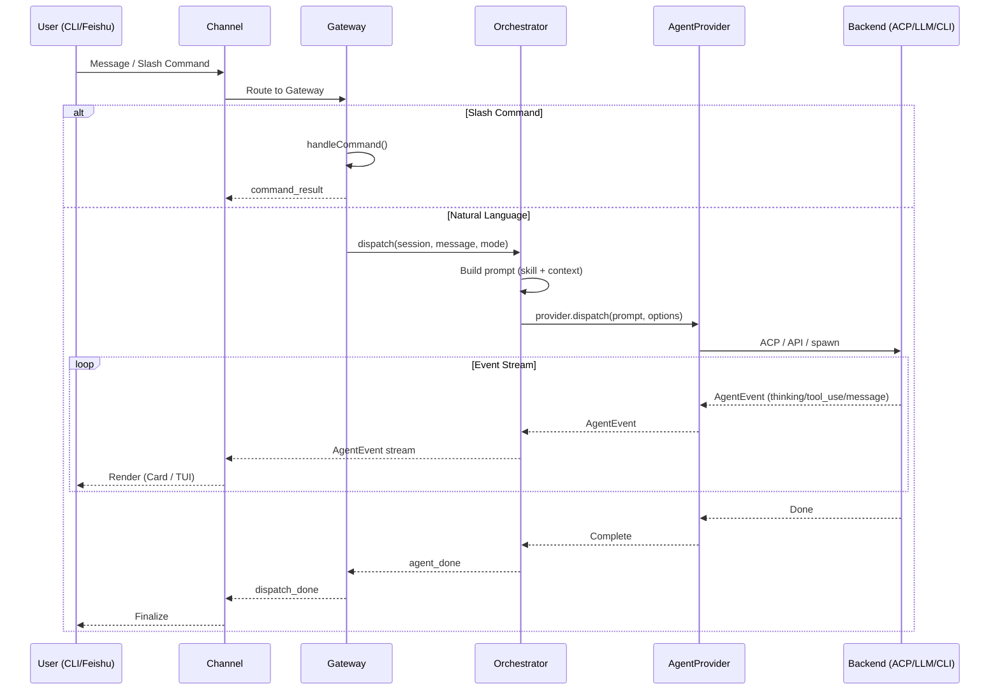

# OpenCrossAgent

Cross-agent orchestration gateway with multi-channel support (CLI + Feishu).

## 架构图

### 总览 (ASCII Art)

```
┌─────────────────────────────────────────────────────────────────────────┐
│                        OpenCrossAgent Gateway                          │
│                                                                        │
│  ┌─────────────┐  ┌──────────────────┐  ┌───────────────────────────┐  │
│  │  Channel    │  │   Session        │  │   Command System          │  │
│  │  Layer      │  │   Manager        │  │   (JSON-defined)          │  │
│  │             │  │                  │  │                           │  │
│  │ IChannel    │  │ SessionStore     │  │ CommandScanner            │  │
│  │ IChannelBridge│ │ SessionQueue    │  │ CommandExecutor           │  │
│  │ IChannelRenderer│ │ Resume       │  │ NodeGraph Engine          │  │
│  └──────┬──────┘  └────────┬─────────┘  └─────────────┬─────────────┘  │
│         │                  │                          │                  │
│         └──────────┬───────┴──────────┬──────────────┘                 │
│                    │                  │                                 │
│                    ▼                  ▼                                 │
│  ┌──────────────────────────────────────────────────────────────────┐   │
│  │                    Orchestrator Layer                             │   │
│  │                                                                  │   │
│  │  AgentOrchestrator                                               │   │
│  │  ├ direct mode    (直接执行)                                      │   │
│  │  ├ plan mode      (只读分析规划)                                   │   │
│  │  └ enhance mode   (技能增强提示词)                                 │   │
│  │                                                                  │   │
│  │  UnifiedDispatchPipeline                                         │   │
│  │  ├ prompt building (budget-aware)                                │   │
│  │  ├ skill injection                                               │   │
│  │  └ AgentEvent stream production                                  │   │
│  └──────────────────────────┬───────────────────────────────────────┘   │
│                             │                                           │
│  ┌──────────────────────────▼───────────────────────────────────────┐   │
│  │                  Agent Provider Layer                             │   │
│  │                                                                  │   │
│  │  IAgentProvider                                                  │   │
│  │  ├ dispatch(prompt, options): AsyncGenerator<AgentEvent>          │   │
│  │  ├ listModels(): Promise<ModelInfo[]>                            │   │
│  │  ├ createSession(): Promise<SessionRef>                          │   │
│  │  ├ resumeSession(ref): Promise<void>                            │   │
│  │  └ stopSession(id): Promise<void>                               │   │
│  │                                                                  │   │
│  │  ProviderRegistry                                                │   │
│  │  ├ register(name, provider)                                      │   │
│  │  ├ get(name): IAgentProvider                                     │   │
│  │  └ resolve(name?): IAgentProvider                                │   │
│  └──────────────────────────┬───────────────────────────────────────┘   │
│                             │                                           │
│  ┌──────────────────────────▼───────────────────────────────────────┐   │
│  │                   Agent Backend Layer                            │   │
│  │                                                                  │   │
│  │  ┌──────────────┐  ┌──────────────┐  ┌────────────────────────┐ │   │
│  │  │ CodelyCli    │  │ DirectLLM    │  │ CliAgent               │ │   │
│  │  │ Provider     │  │ Provider     │  │ Provider               │ │   │
│  │  │              │  │              │  │                        │ │   │
│  │  │ ACP 协议     │  │ OpenAI API   │  │ spawn 子进程            │ │   │
│  │  │ (长驻进程)   │  │ Anthropic    │  │ claude-code / aider    │ │   │
│  │  │              │  │ Gemini API   │  │ stdout → AgentEvent    │ │   │
│  │  │              │  │              │  │                        │ │   │
│  │  │ MCP 工具支持  │  │ 工具调用支持  │  │ 透传模式               │ │   │
│  │  └──────────────┘  └──────────────┘  └────────────────────────┘ │   │
│  └──────────────────────────────────────────────────────────────────┘   │
│                                                                        │
│  ┌──────────────────────────────────────────────────────────────────┐   │
│  │                      MCP Tool Server                             │   │
│  │  current_context / list_sessions / list_providers / send_image   │   │
│  └──────────────────────────────────────────────────────────────────┘   │
└─────────────────────────────────────────────────────────────────────────┘

         ┌──────────────────┐              ┌──────────────────┐
         │   CLI Channel    │              │  Feishu Channel   │
         │                  │              │                   │
         │  WebSocket client │              │  Feishu WebSocket│
         │  (TUI 客户端)     │              │  Card rendering   │
         │  Event passthrough│              │  Image upload    │
         │                  │              │                   │
         └────────┬─────────┘              └────────┬──────────┘
                  │                                 │
                  └──────────┬──────────────────────┘
                             │
                     User (终端 / 飞书)
```

### 架构图 (Mermaid)

```mermaid
graph TB
    subgraph "Users"
        U1[CLI User]
        U2[Feishu User]
    end

    subgraph "Channel Layer"
        CLI[CLI Channel<br/>WebSocket + TUI]
        FS[Feishu Channel<br/>WebSocket + Cards]
    end

    subgraph "Gateway"
        GW[HTTP/WS Server<br/>Message Router]
        SM[Session Manager<br/>SessionStore + Queue]
        CS[Command System<br/>Scanner + Executor]
    end

    subgraph "Orchestration Layer"
        ORC[AgentOrchestrator<br/>direct / plan / enhance]
        PIPE[UnifiedDispatchPipeline<br/>Prompt Building + Skill Injection]
    end

    subgraph "Agent Provider Layer"
        REG[ProviderRegistry]
        IAP[IAgentProvider Interface]
    end

    subgraph "Agent Backend Layer"
        CLP[CodelyCliProvider<br/>ACP Protocol]
        DLP[DirectLLMProvider<br/>OpenAI / Anthropic / Gemini]
        CAP[CliAgentProvider<br/>spawn subprocess]
    end

    subgraph "MCP"
        MCP[Tool Server<br/>context / sessions / providers]
    end

    U1 -->|WebSocket| CLI
    U2 -->|Feishu WS| FS

    CLI --> GW
    FS --> GW
    GW --> SM
    GW --> CS
    GW --> ORC

    ORC --> PIPE
    PIPE --> REG
    REG --> IAP

    IAP --> CLP
    IAP --> DLP
    IAP --> CAP

    CLP -.->|MCP stdio| MCP
    DLP -.->|HTTP API| MCP
    MCP -.->|HTTP REST| GW
```

### 消息流程图



## License

MIT
