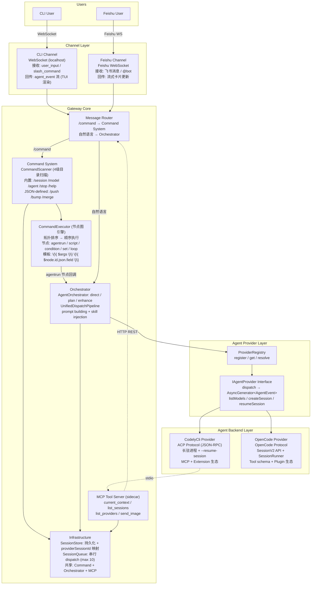

# OpenCrossAgent

Cross-agent orchestration gateway with multi-channel support (CLI + Feishu).

## Architecture

```mermaid
graph TB
    subgraph Users
        U1[CLI User]
        U2[Feishu User]
    end

    subgraph ChannelLayer["Channel Layer"]
        CLI["CLI Channel<br/>WebSocket (localhost)<br/>接收: user_input / slash_command<br/>回传: agent_event 流 (TUI 渲染)"]
        FS["Feishu Channel<br/>Feishu WebSocket<br/>接收: 飞书消息 / @bot<br/>回传: 流式卡片更新"]
    end

    subgraph GatewayCore["Gateway Core"]
        ROUTER["Message Router<br/>/command → Command System<br/>自然语言 → Orchestrator"]
        CS["Command System<br/>CommandScanner (4级目录扫描)<br/>内置: /session /model /agent /stop /help<br/>JSON-defined: /push /bump /merge"]
        EXEC["CommandExecutor (节点图引擎)<br/>拓扑排序 → 顺序执行<br/>节点: agentrun / script / condition / set / loop<br/>模板: \{\{ $args \}\} \{\{ $node.id.json.field \}\}"]
        ORC["Orchestrator<br/>AgentOrchestrator: direct / plan / enhance<br/>UnifiedDispatchPipeline<br/>prompt building + skill injection"]
        INFRA["Infrastructure<br/>SessionStore: 持久化 + providerSessionId 映射<br/>SessionQueue: 串行 dispatch (max 10)<br/>共享: Command + Orchestrator + MCP"]
        MCP["MCP Tool Server (sidecar)<br/>current_context / list_sessions<br/>list_providers / send_image"]
    end

    subgraph ProviderLayer["Agent Provider Layer"]
        REG["ProviderRegistry<br/>register / get / resolve"]
        IAP["IAgentProvider Interface<br/>dispatch → AsyncGenerator&lt;AgentEvent&gt;<br/>listModels / createSession / resumeSession"]
    end

    subgraph BackendLayer["Agent Backend Layer"]
        CLP["CodelyCli Provider<br/>ACP Protocol (JSON-RPC)<br/>长驻进程 + --resume-session<br/>MCP + Extension 生态"]
        OCP["OpenCode Provider<br/>OpenCode Protocol<br/>SessionV2 API + SessionRunner<br/>Tool schema + Plugin 生态"]
    end

    U1 -->|WebSocket| CLI
    U2 -->|Feishu WS| FS

    CLI --> ROUTER
    FS --> ROUTER

    ROUTER -->|/command| CS
    CS --> EXEC
    EXEC -->|agentrun 节点回调| ORC
    ROUTER -->|自然语言| ORC

    CS --> INFRA
    ORC --> INFRA
    MCP --> INFRA
    ORC --> REG

    REG --> IAP

    IAP --> CLP
    IAP --> OCP

    CLP -.->|stdio| MCP
    MCP -.->|HTTP REST| ROUTER
```

## License

MIT
