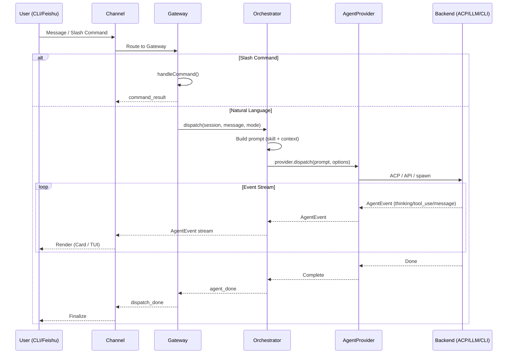

# OpenCrossAgent

Cross-agent orchestration gateway with multi-channel support (CLI + Feishu).

OpenCrossAgent 是一个跨多个通用 AI agent 调用的编排网关，支持多种前端 channel，能够统一调度不同的底层 AI agent 后端（codely-cli、Direct LLM API、通用 CLI agent）。

## 架构图

### 总览 (ASCII Art)

```
┌─────────────────────────────────────────────────────────────────────────┐
│                        OpenCrossAgent Gateway                          │
│                                                                        │
│  ┌─────────────┐  ┌──────────────────┐  ┌───────────────────────────┐  │
│  │  Channel    │  │   Session        │  │   Command System          │  │
│  │  Layer      │  │   Manager        │  │   (JSON-defined)          │  │
│  │             │  │                  │  │                           │  │
│  │ IChannel    │  │ SessionStore     │  │ CommandScanner            │  │
│  │ IChannelBridge│ │ SessionQueue    │  │ CommandExecutor           │  │
│  │ IChannelRenderer│ │ Resume       │  │ NodeGraph Engine          │  │
│  └──────┬──────┘  └────────┬─────────┘  └─────────────┬─────────────┘  │
│         │                  │                          │                  │
│         └──────────┬───────┴──────────┬──────────────┘                 │
│                    │                  │                                 │
│                    ▼                  ▼                                 │
│  ┌──────────────────────────────────────────────────────────────────┐   │
│  │                    Orchestrator Layer                             │   │
│  │                                                                  │   │
│  │  AgentOrchestrator                                               │   │
│  │  ├ direct mode    (直接执行)                                      │   │
│  │  ├ plan mode      (只读分析规划)                                   │   │
│  │  └ enhance mode   (技能增强提示词)                                 │   │
│  │                                                                  │   │
│  │  UnifiedDispatchPipeline                                         │   │
│  │  ├ prompt building (budget-aware)                                │   │
│  │  ├ skill injection                                               │   │
│  │  └ AgentEvent stream production                                  │   │
│  └──────────────────────────┬───────────────────────────────────────┘   │
│                             │                                           │
│  ┌──────────────────────────▼───────────────────────────────────────┐   │
│  │                  Agent Provider Layer                             │   │
│  │                                                                  │   │
│  │  IAgentProvider                                                  │   │
│  │  ├ dispatch(prompt, options): AsyncGenerator<AgentEvent>          │   │
│  │  ├ listModels(): Promise<ModelInfo[]>                            │   │
│  │  ├ createSession(): Promise<SessionRef>                          │   │
│  │  ├ resumeSession(ref): Promise<void>                            │   │
│  │  └ stopSession(id): Promise<void>                               │   │
│  │                                                                  │   │
│  │  ProviderRegistry                                                │   │
│  │  ├ register(name, provider)                                      │   │
│  │  ├ get(name): IAgentProvider                                     │   │
│  │  └ resolve(name?): IAgentProvider                                │   │
│  └──────────────────────────┬───────────────────────────────────────┘   │
│                             │                                           │
│  ┌──────────────────────────▼───────────────────────────────────────┐   │
│  │                   Agent Backend Layer                            │   │
│  │                                                                  │   │
│  │  ┌──────────────┐  ┌──────────────┐  ┌────────────────────────┐ │   │
│  │  │ CodelyCli    │  │ DirectLLM    │  │ CliAgent               │ │   │
│  │  │ Provider     │  │ Provider     │  │ Provider               │ │   │
│  │  │              │  │              │  │                        │ │   │
│  │  │ ACP 协议     │  │ OpenAI API   │  │ spawn 子进程            │ │   │
│  │  │ (长驻进程)   │  │ Anthropic    │  │ claude-code / aider    │ │   │
│  │  │              │  │ Gemini API   │  │ stdout → AgentEvent    │ │   │
│  │  │              │  │              │  │                        │ │   │
│  │  │ MCP 工具支持  │  │ 工具调用支持  │  │ 透传模式               │ │   │
│  │  └──────────────┘  └──────────────┘  └────────────────────────┘ │   │
│  └──────────────────────────────────────────────────────────────────┘   │
│                                                                        │
│  ┌──────────────────────────────────────────────────────────────────┐   │
│  │                      MCP Tool Server                             │   │
│  │  current_context / list_sessions / list_providers / send_image   │   │
│  └──────────────────────────────────────────────────────────────────┘   │
└─────────────────────────────────────────────────────────────────────────┘

         ┌──────────────────┐              ┌──────────────────┐
         │   CLI Channel    │              │  Feishu Channel   │
         │                  │              │                   │
         │  WebSocket client │              │  Feishu WebSocket│
         │  (TUI 客户端)     │              │  Card rendering   │
         │  Event passthrough│              │  Image upload    │
         │                  │              │                   │
         └────────┬─────────┘              └────────┬──────────┘
                  │                                 │
                  └──────────┬──────────────────────┘
                             │
                     User (终端 / 飞书)
```

### 架构图 (Mermaid)

```mermaid
graph TB
    subgraph "Users"
        U1[CLI User]
        U2[Feishu User]
    end

    subgraph "Channel Layer"
        CLI[CLI Channel<br/>WebSocket + TUI]
        FS[Feishu Channel<br/>WebSocket + Cards]
    end

    subgraph "Gateway"
        GW[HTTP/WS Server<br/>Message Router]
        SM[Session Manager<br/>SessionStore + Queue]
        CS[Command System<br/>Scanner + Executor]
    end

    subgraph "Orchestration Layer"
        ORC[AgentOrchestrator<br/>direct / plan / enhance]
        PIPE[UnifiedDispatchPipeline<br/>Prompt Building + Skill Injection]
    end

    subgraph "Agent Provider Layer"
        REG[ProviderRegistry]
        IAP[IAgentProvider Interface]
    end

    subgraph "Agent Backend Layer"
        CLP[CodelyCliProvider<br/>ACP Protocol]
        DLP[DirectLLMProvider<br/>OpenAI / Anthropic / Gemini]
        CAP[CliAgentProvider<br/>spawn subprocess]
    end

    subgraph "MCP"
        MCP[Tool Server<br/>context / sessions / providers]
    end

    U1 -->|WebSocket| CLI
    U2 -->|Feishu WS| FS

    CLI --> GW
    FS --> GW
    GW --> SM
    GW --> CS
    GW --> ORC

    ORC --> PIPE
    PIPE --> REG
    REG --> IAP

    IAP --> CLP
    IAP --> DLP
    IAP --> CAP

    CLP -.->|MCP stdio| MCP
    DLP -.->|HTTP API| MCP
    MCP -.->|HTTP REST| GW
```

### 消息流程图



## 核心设计

### Channel 抽象 (IChannel)

参考 teamcodelyclaw 的 IChannel 设计，分离三个接口：

```typescript
// 主接口 — 处理完整 dispatch 生命周期
interface IChannel {
  readonly channelType: "cli" | "feishu";
  handleDispatch(sessionName: string, message: string, config: GatewayConfig): Promise<void>;
  stopDispatch(sessionName: string): void;
  stopAllDispatches(): number;
  dispose(): Promise<void>;
}

// 渲染器 — channel 特定的输出渲染
interface IChannelRenderer {
  showThinking(sessionName: string): void;
  appendText(text: string): void;
  showTool(toolName: string, display?: string): void;
  showError(message: string): void;
  finalize(success: boolean): Promise<void>;
}

// 事件桥接 — agent 事件 → 渲染器驱动
interface IChannelBridge {
  processEvent(event: AgentEvent): void;
  getAccumulatedText(): string;
  isAgenticMode(): boolean;
  dispose(): void;
}
```

### Agent Provider 抽象 (IAgentProvider) — 核心创新

OpenCrossAgent 与 teamcodelyclaw 的关键区别：teamcodelyclaw 紧耦合 codely-cli，OpenCrossAgent 引入 Agent Provider 抽象层，支持运行时切换不同的 AI agent 后端。

```typescript
interface IAgentProvider {
  readonly name: string;
  readonly capabilities: ProviderCapabilities;

  // 核心调度 — 返回 AgentEvent 流
  dispatch(prompt: string, options: DispatchOptions): AsyncGenerator<AgentEvent>;

  // 模型管理
  listModels(): Promise<ModelInfo[]>;

  // Session 生命周期
  createSession(workspaceDir: string): Promise<SessionRef>;
  resumeSession(ref: SessionRef): Promise<void>;
  stopSession(sessionId: string): Promise<void>;

  dispose(): Promise<void>;
}

interface ProviderCapabilities {
  supportsTools: boolean;
  supportsMCP: boolean;
  supportsStreaming: boolean;
  supportsResume: boolean;
  maxContextWindow: number;
}
```

### Agent Backend 实现

| Provider | 通信方式 | Session 续接 | MCP 支持 | 适用场景 |
|----------|----------|-------------|----------|----------|
| **CodelyCliProvider** | ACP 协议 (JSON-RPC 长驻进程) | `--resume-session` | ✅ stdio | 完整 agent 能力，工具调用，代码操作 |
| **DirectLLMProvider** | HTTP API (OpenAI/Anthropic/Gemini) | 自管理对话历史 | ❌ | 轻量级，无 agent 框架依赖 |
| **CliAgentProvider** | spawn 子进程 | `--resume` (如果后端支持) | ❌ | 集成其他 CLI AI agent |

## 目录结构

```
OpenCrossAgent/
├── packages/
│   ├── gateway/              # Gateway 核心服务
│   │   ├── src/
│   │   │   ├── gateway.ts           # HTTP/WS 服务 + 消息路由
│   │   │   ├── entry.ts             # 服务入口
│   │   │   ├── session-store.ts     # Session 持久化
│   │   │   ├── session-queue.ts     # 消息队列 (串行 dispatch)
│   │   │   ├── logger.ts            # 文件日志
│   │   │   ├── channel/             # Channel 抽象层
│   │   │   │   ├── types.ts         #   IChannel, IChannelBridge, IChannelRenderer
│   │   │   │   └── index.ts
│   │   │   ├── channel-cli/         # CLI Channel (待实现)
│   │   │   │   ├── cli-channel.ts
│   │   │   │   └── cli-ws-server.ts
│   │   │   ├── channel-feishu/      # Feishu Channel (待实现)
│   │   │   │   ├── feishu-channel.ts
│   │   │   │   ├── feishu-client.ts
│   │   │   │   ├── feishu-card.ts
│   │   │   │   └── card-updater.ts
│   │   │   ├── provider/            # Agent Provider 抽象层
│   │   │   │   ├── types.ts         #   IAgentProvider, ProviderCapabilities
│   │   │   │   ├── registry.ts      #   ProviderRegistry
│   │   │   │   ├── codely-cli/      # CodelyCliProvider (待实现)
│   │   │   │   ├── direct-llm/      # DirectLLMProvider (待实现)
│   │   │   │   └── cli-agent/       # CliAgentProvider (待实现)
│   │   │   ├── orchestrator/        # Agent 编排层 (待实现)
│   │   │   │   ├── orchestrator.ts
│   │   │   │   ├── dispatch-pipeline.ts
│   │   │   │   ├── plan-parser.ts
│   │   │   │   ├── types.ts
│   │   │   │   └── skills/
│   │   │   ├── command/             # 命令系统 (待实现)
│   │   │   └── mcp/                 # MCP 工具服务器 (待实现)
│   │   ├── package.json
│   │   └── tsconfig.json
│   │
│   ├── cli-client/            # CLI 客户端
│   │   ├── src/
│   │   │   └── main.ts              # WebSocket 客户端
│   │   ├── package.json
│   │   └── tsconfig.json
│   │
│   └── shared/                # 共享类型
│       ├── src/
│       │   ├── events.ts            # AgentEvent 联合类型
│       │   ├── session.ts          # Session/Model/Goal 类型
│       │   ├── protocol.ts         # WS 协议类型
│       │   └── index.ts
│       ├── package.json
│       └── tsconfig.json
│
├── pnpm-workspace.yaml
├── package.json
├── tsconfig.base.json
└── README.md
```

## 技术栈

| 技术 | 用途 |
|------|------|
| TypeScript (ES2023 / NodeNext) | 语言 |
| Node.js 22+ | 运行时 |
| pnpm workspace | Monorepo 包管理 |
| `ws` | WebSocket 服务器/客户端 |
| vitest | 测试框架 |

## 参考项目

| 项目 | 借鉴点 |
|------|--------|
| [teamcodelyclaw](https://github.com/Lu-Kye/teamcodelyclaw) | IChannel 抽象、AgentOrchestrator 模式、Gateway 路由、Session 管理、AgentEvent 流 |
| [opencode](https://github.com/sst/opencode) | Provider/Model 抽象、Tool schema 系统、Protocol 层 |
| [codely-cli](https://codely.dev) | ACP 协议、多模型 provider、Extension 系统 |

## License

MIT
